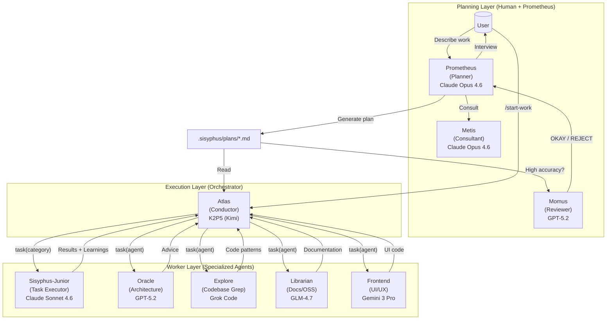
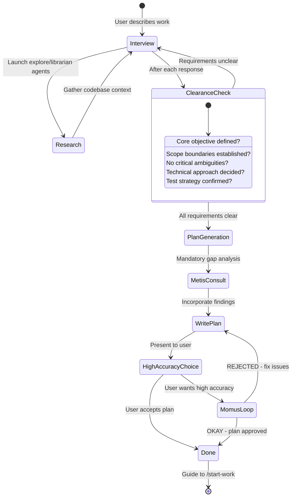
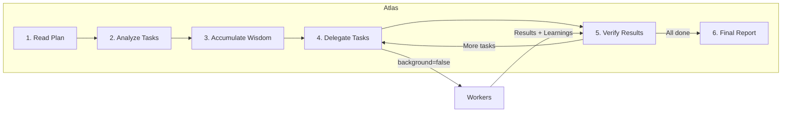

# Orchestration System Guide

Oh My OpenCode's orchestration system transforms a simple AI agent into a coordinated development team through **separation of planning and execution**.

---

## TL;DR - When to Use What

| Complexity | Approach | When to Use |
|------------|----------|-------------|
| **Simple** | Just prompt | Simple tasks, quick fixes, single-file changes |
| **Complex + Lazy** | Type `ulw` or `ultrawork` | Complex tasks where explaining context is tedious. Agent figures it out. |
| **Complex + Precise** | `@plan` → `/start-work` | Precise, multi-step work requiring true orchestration. Prometheus plans, Atlas executes. |

**Decision Flow:**

```
Is it a quick fix or simple task?
  └─ YES → Just prompt normally
  └─ NO  → Is explaining the full context tedious?
              └─ YES → Type "ulw" and let the agent figure it out
              └─ NO  → Do you need precise, verifiable execution?
                         └─ YES → Use @plan for Prometheus planning, then /start-work
                         └─ NO  → Just use "ulw"
```

---

## The Architecture

The orchestration system uses a three-layer architecture that solves context overload, cognitive drift, and verification gaps through specialization and delegation.



---

## Planning: Prometheus + Metis + Momus

### Prometheus: Your Strategic Consultant

Prometheus is not just a planner, it's an intelligent interviewer that helps you think through what you actually need. It is **READ-ONLY** - can only create or modify markdown files within `.sisyphus/` directory.

**The Interview Process:**



**Intent-Specific Strategies:**

Prometheus adapts its interview style based on what you're doing:

| Intent | Prometheus Focus | Example Questions |
|--------|------------------|-------------------|
| **Refactoring** | Safety - behavior preservation | "What tests verify current behavior?" "Rollback strategy?" |
| **Build from Scratch** | Discovery - patterns first | "Found pattern X in codebase. Follow it or deviate?" |
| **Mid-sized Task** | Guardrails - exact boundaries | "What must NOT be included? Hard constraints?" |
| **Architecture** | Strategic - long-term impact | "Expected lifespan? Scale requirements?" |

### Metis: The Gap Analyzer

Before Prometheus writes the plan, Metis catches what Prometheus missed:

- Hidden intentions in user's request
- Ambiguities that could derail implementation
- AI-slop patterns (over-engineering, scope creep)
- Missing acceptance criteria
- Edge cases not addressed

**Why Metis Exists:**

The plan author (Prometheus) has "ADHD working memory" - it makes connections that never make it onto the page. Metis forces externalization of implicit knowledge.

### Momus: The Ruthless Reviewer

For high-accuracy mode, Momus validates plans against four core criteria:

1. **Clarity**: Does each task specify WHERE to find implementation details?
2. **Verification**: Are acceptance criteria concrete and measurable?
3. **Context**: Is there sufficient context to proceed without >10% guesswork?
4. **Big Picture**: Is the purpose, background, and workflow clear?

**The Momus Loop:**

Momus only says "OKAY" when:
- 100% of file references verified
- ≥80% of tasks have clear reference sources
- ≥90% of tasks have concrete acceptance criteria
- Zero tasks require assumptions about business logic
- Zero critical red flags

If REJECTED, Prometheus fixes issues and resubmits. No maximum retry limit.

---

## Execution: Atlas

### The Conductor Mindset

Atlas is like an orchestra conductor: it doesn't play instruments, it ensures perfect harmony.



**What Atlas CAN do:**
- Read files to understand context
- Run commands to verify results
- Use lsp_diagnostics to check for errors
- Search patterns with grep/glob/ast-grep

**What Atlas MUST delegate:**
- Writing or editing code files
- Fixing bugs
- Creating tests
- Git commits

### Wisdom Accumulation

The power of orchestration is cumulative learning. After each task:

1. Extract learnings from subagent's response
2. Categorize into: Conventions, Successes, Failures, Gotchas, Commands
3. Pass forward to ALL subsequent subagents

This prevents repeating mistakes and ensures consistent patterns.

**Notepad System:**

```
.sisyphus/notepads/{plan-name}/
├── learnings.md      # Patterns, conventions, successful approaches
├── decisions.md      # Architectural choices and rationales
├── issues.md         # Problems, blockers, gotchas encountered
├── verification.md   # Test results, validation outcomes
└── problems.md       # Unresolved issues, technical debt
```

---

## Workers: Sisyphus-Junior and Specialists

### Sisyphus-Junior: The Task Executor

Junior is the workhorse that actually writes code. Key characteristics:

- **Focused**: Cannot delegate (blocked from task tool)
- **Disciplined**: Obsessive todo tracking
- **Verified**: Must pass lsp_diagnostics before completion
- **Constrained**: Cannot modify plan files (READ-ONLY)

**Why Sonnet is Sufficient:**

Junior doesn't need to be the smartest - it needs to be reliable. With:
1. Detailed prompts from Atlas (50-200 lines)
2. Accumulated wisdom passed forward
3. Clear MUST DO / MUST NOT DO constraints
4. Verification requirements

Even a mid-tier model executes precisely. The intelligence is in the **system**, not individual agents.

### System Reminder Mechanism

The hook system ensures Junior never stops halfway:

```
[SYSTEM REMINDER - TODO CONTINUATION]

You have incomplete todos! Complete ALL before responding:
- [ ] Implement user service ← IN PROGRESS
- [ ] Add validation
- [ ] Write tests

DO NOT respond until all todos are marked completed.
```

This "boulder pushing" mechanism is why the system is named after Sisyphus.

---

## Category + Skill System

### Why Categories are Revolutionary

**The Problem with Model Names:**

```typescript
// OLD: Model name creates distributional bias
task(agent="gpt-5.2", prompt="...")  // Model knows its limitations
task(agent="claude-opus-4.6", prompt="...")  // Different self-perception
```

**The Solution: Semantic Categories:**

```typescript
// NEW: Category describes INTENT, not implementation
task(category="ultrabrain", prompt="...")     // "Think strategically"
task(category="visual-engineering", prompt="...")  // "Design beautifully"
task(category="quick", prompt="...")          // "Just get it done fast"
```

### Built-in Categories

| Category | Model | When to Use |
|----------|-------|-------------|
| `visual-engineering` | Gemini 3 Pro | Frontend, UI/UX, design, styling, animation |
| `ultrabrain` | GPT-5.3 Codex (xhigh) | Deep logical reasoning, complex architecture decisions |
| `artistry` | Gemini 3 Pro (max) | Highly creative or artistic tasks, novel ideas |
| `quick` | Claude Haiku 4.5 | Trivial tasks - single file changes, typo fixes |
| `deep` | GPT-5.3 Codex (medium) | Goal-oriented autonomous problem-solving, thorough research |
| `unspecified-low` | Claude Sonnet 4.6 | Tasks that don't fit other categories, low effort |
| `unspecified-high` | Claude Opus 4.6 (max) | Tasks that don't fit other categories, high effort |
| `writing` | K2P5 (Kimi) | Documentation, prose, technical writing |

### Skills: Domain-Specific Instructions

Skills prepend specialized instructions to subagent prompts:

```typescript
// Category + Skill combination
task(
  category="visual-engineering", 
  load_skills=["frontend-ui-ux"],  // Adds UI/UX expertise
  prompt="..."
)

task(
  category="general",
  load_skills=["playwright"],  // Adds browser automation expertise
  prompt="..."
)
```

---

## Usage Patterns

### How to Invoke Prometheus

**Method 1: Switch to Prometheus Agent (Tab → Select Prometheus)**

```
1. Press Tab at the prompt
2. Select "Prometheus" from the agent list
3. Describe your work: "I want to refactor the auth system"
4. Answer interview questions
5. Prometheus creates plan in .sisyphus/plans/{name}.md
```

**Method 2: Use @plan Command (in Sisyphus)**

```
1. Stay in Sisyphus (default agent)
2. Type: @plan "I want to refactor the auth system"
3. The @plan command automatically switches to Prometheus
4. Answer interview questions
5. Prometheus creates plan in .sisyphus/plans/{name}.md
```

**Which Should You Use?**

| Scenario | Recommended Method | Why |
|----------|-------------------|-----|
| **New session, starting fresh** | Switch to Prometheus agent | Clean mental model - you're entering "planning mode" |
| **Already in Sisyphus, mid-work** | Use @plan | Convenient, no agent switch needed |
| **Want explicit control** | Switch to Prometheus agent | Clear separation of planning vs execution contexts |
| **Quick planning interrupt** | Use @plan | Fastest path from current context |

Both methods trigger the same Prometheus planning flow. The @plan command is simply a convenience shortcut.

### /start-work Behavior and Session Continuity

**What Happens When You Run /start-work:**

```
User: /start-work
    ↓
[start-work hook activates]
    ↓
Check: Does .sisyphus/boulder.json exist?
    ↓
    ├─ YES (existing work) → RESUME MODE
    │   - Read the existing boulder state
    │   - Calculate progress (checked vs unchecked boxes)
    │   - Inject continuation prompt with remaining tasks
    │   - Atlas continues where you left off
    │
    └─ NO (fresh start) → INIT MODE
        - Find the most recent plan in .sisyphus/plans/
        - Create new boulder.json tracking this plan
        - Switch session agent to Atlas
        - Begin execution from task 1
```

**Session Continuity Explained:**

The `boulder.json` file tracks:
- **active_plan**: Path to the current plan file
- **session_ids**: All sessions that have worked on this plan
- **started_at**: When work began
- **plan_name**: Human-readable plan identifier

**Example Timeline:**

```
Monday 9:00 AM
  └─ @plan "Build user authentication"
  └─ Prometheus interviews and creates plan
  └─ User: /start-work
  └─ Atlas begins execution, creates boulder.json
  └─ Task 1 complete, Task 2 in progress...
  └─ [Session ends - computer crash, user logout, etc.]

Monday 2:00 PM (NEW SESSION)
  └─ User opens new session (agent = Sisyphus by default)
  └─ User: /start-work
  └─ [start-work hook reads boulder.json]
  └─ "Resuming 'Build user authentication' - 3 of 8 tasks complete"
  └─ Atlas continues from Task 3 (no context lost)
```

Atlas is automatically activated when you run `/start-work`. You don't need to manually switch to Atlas.

### Hephaestus vs Sisyphus + ultrawork

**Quick Comparison:**

| Aspect | Hephaestus | Sisyphus + `ulw` / `ultrawork` |
|--------|-----------|-------------------------------|
| **Model** | GPT-5.3 Codex (medium reasoning) | Claude Opus 4.6 (your default) |
| **Approach** | Autonomous deep worker | Keyword-activated ultrawork mode |
| **Best For** | Complex architectural work, deep reasoning | General complex tasks, "just do it" scenarios |
| **Planning** | Self-plans during execution | Uses Prometheus plans if available |
| **Delegation** | Heavy use of explore/librarian agents | Uses category-based delegation |
| **Temperature** | 0.1 | 0.1 |

**When to Use Hephaestus:**

Switch to Hephaestus (Tab → Select Hephaestus) when:

1. **Deep architectural reasoning needed**
   - "Design a new plugin system"
   - "Refactor this monolith into microservices"

2. **Complex debugging requiring inference chains**
   - "Why does this race condition only happen on Tuesdays?"
   - "Trace this memory leak through 15 files"

3. **Cross-domain knowledge synthesis**
   - "Integrate our Rust core with the TypeScript frontend"
   - "Migrate from MongoDB to PostgreSQL with zero downtime"

4. **You specifically want GPT-5.3 Codex reasoning**
   - Some problems benefit from GPT-5.3 Codex's training characteristics

**When to Use Sisyphus + `ulw`:**

Use the `ulw` keyword in Sisyphus when:

1. **You want the agent to figure it out**
   - "ulw fix the failing tests"
   - "ulw add input validation to the API"

2. **Complex but well-scoped tasks**
   - "ulw implement JWT authentication following our patterns"
   - "ulw create a new CLI command for deployments"

3. **You're feeling lazy** (officially supported use case)
   - Don't want to write detailed requirements
   - Trust the agent to explore and decide

4. **You want to leverage existing plans**
   - If a Prometheus plan exists, `ulw` mode can use it
   - Falls back to autonomous exploration if no plan

**Recommendation:**

- **For most users**: Use `ulw` keyword in Sisyphus. It's the default path and works excellently for 90% of complex tasks.
- **For power users**: Switch to Hephaestus when you specifically need GPT-5.3 Codex's reasoning style or want the "AmpCode deep mode" experience of fully autonomous exploration and execution.

---

## Configuration

You can control related features in `oh-my-opencode.json`:

```jsonc
{
  "sisyphus_agent": {
    "disabled": false,           // Enable Atlas orchestration (default: false)
    "planner_enabled": true,     // Enable Prometheus (default: true)
    "replace_plan": true         // Replace default plan agent with Prometheus (default: true)
  },
  
  // Hook settings (add to disable)
  "disabled_hooks": [
    // "start-work",             // Disable execution trigger
    // "prometheus-md-only"      // Remove Prometheus write restrictions (not recommended)
  ]
}
```

---

## Troubleshooting

### "I switched to Prometheus but nothing happened"

Prometheus enters interview mode by default. It will ask you questions about your requirements. Answer them, then say "make it a plan" when ready.

### "/start-work says 'no active plan found'"

Either:
- No plans exist in `.sisyphus/plans/` → Create one with Prometheus first
- Plans exist but boulder.json points elsewhere → Delete `.sisyphus/boulder.json` and retry

### "I'm in Atlas but I want to switch back to normal mode"

Type `exit` or start a new session. Atlas is primarily entered via `/start-work` - you don't typically "switch to Atlas" manually.

### "What's the difference between @plan and just switching to Prometheus?"

**Nothing functional.** Both invoke Prometheus. @plan is a convenience command while switching agents is explicit control. Use whichever feels natural.

### "Should I use Hephaestus or type ulw?"

**For most tasks**: Type `ulw` in Sisyphus.

**Use Hephaestus when**: You specifically need GPT-5.3 Codex's reasoning style for deep architectural work or complex debugging.

---

## Further Reading

- [Overview](./overview.md)
- [Features Reference](../reference/features.md)
- [Configuration Reference](../reference/configuration.md)
- [Manifesto](../manifesto.md)
